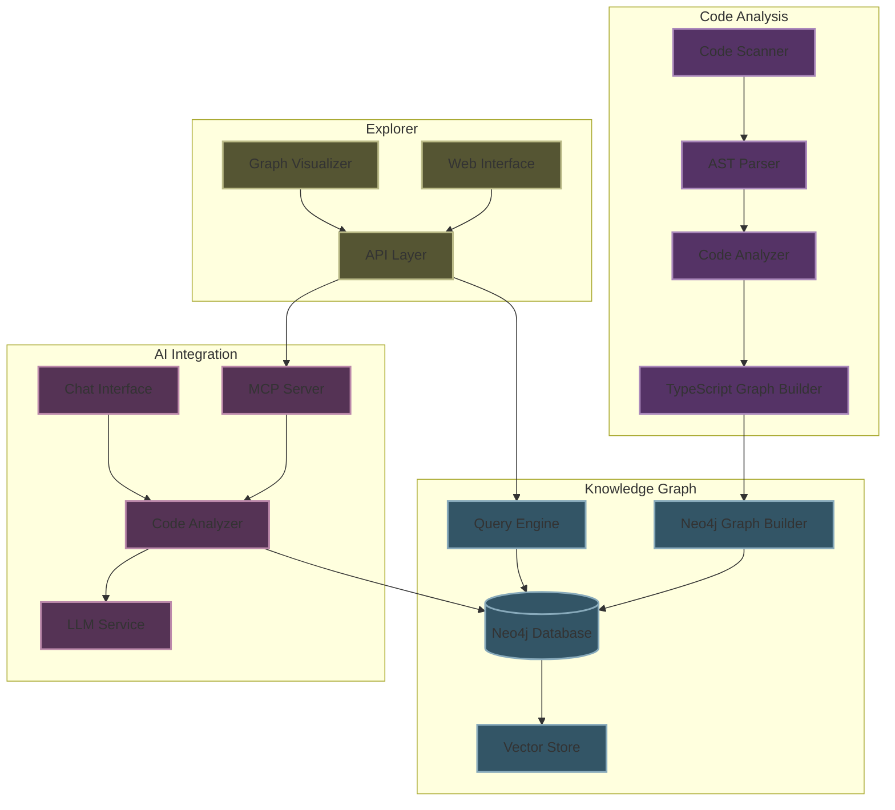

# Graph-Code: Codebase Knowledge Graph System

A powerful TypeScript-based code analysis system that transforms your codebase into a comprehensive Knowledge Graph using Neo4j. Graph-Code creates a navigable Codebase Knowledge Graph, enabling advanced analysis, visualization, and AI-powered natural language queries about your code structure and relationships.

## 🧠 Why Codebase Knowledge Graphs?

Codebase Knowledge Graphs offer significant advantages over traditional code analysis tools:

- **Relationship-First Analysis**: Unlike flat file analysis, Codebase Knowledge Graphs capture the relationships between code entities, providing insights into how components interact.
- **Natural Language Exploration**: Query your codebase using everyday language rather than complex search patterns.
- **Knowledge Graph vs. Vector Database**: Codebase Knowledge Graphs use graph databases instead of vector databases, allowing queries that follow meaningful relationships rather than just similarity scores.
- **Visual Understanding**: See the structure of your code visually, making it easier to understand complex architectures.
- **Precise Impact Analysis**: Predict exactly which components will be affected by changes to specific code elements.

## 🔄 How It Works

1. **Code Parsing**: The system scans your codebase using the TypeScript Compiler API.
2. **Knowledge Graph Construction**: Code entities and relationships are extracted and transformed into a comprehensive graph model.
3. **Neo4j Storage**: The Codebase Knowledge Graph is stored in Neo4j database for efficient querying.
4. **AI Integration**: Natural language interfaces connect to LLMs to transform questions into graph queries.
5. **Visualization**: Results are presented through interactive visualizations and API responses.

## 🌟 Features

- **Codebase Analysis**: Parse and analyze TypeScript/JavaScript codebases with the TypeScript Compiler API
- **Knowledge Graph Generation**: Store and query code relationships in Neo4j graph database
- **Advanced Querying**: Use natural language and Cypher queries to explore code relationships
- **AI Integration**: Leverage AI models to transform natural language questions into graph queries
- **NestJS Support**: Special handling for NestJS applications with module, controller, and provider analysis
- **Improved Code Understanding**: Visualize and understand complex code structures and relationships
- **Impact Analysis**: Assess the ripple effects of code changes before implementation
- **Dependency Tracking**: Identify and manage dependencies between components

## 💡 Use Cases

The Codebase Knowledge Graph provides practical applications that have been validated in real-world scenarios:

- **Code Navigation**: Easily traverse complex codebases by following relationships between components.
- **Code Understanding**: Gain insights into modules, functions, classes, and methods and their relationships.
- **Documentation Generation**: Automatically generate documentation based on code structure.
- **Dependency Discovery**: Identify and map dependencies within your code.
- **Impact Analysis**: Understand how changes to one part of the code affect other components.
- **Code Search**: Find code not just by keywords but by understanding relationships between elements.

## 🏗️ Architecture

The Codebase Knowledge Graph system consists of these main components:

1. **Code Scanner & Parser**

   - Uses TypeScript Compiler API
   - Implements incremental parsing
   - Handles multiple file types

2. **Knowledge Graph Engine**

   - Neo4j database backend
   - Optimized Cypher queries
   - APOC integration

3. **Explorer Interface**

   - Interactive visualization
   - RESTful API
   - Real-time updates

4. **AI Integration**
   - Natural language processing for code queries
   - Automatic Cypher query generation
   - MCP (Model Context Protocol) server for IDE integration
   - Code analysis and insights generation

### System Architecture Diagram



## 📊 Data Model

The Codebase Knowledge Graph uses the following entities and relationships structure:

```mermaid
erDiagram
    Module {
        string id PK
        string name
        string filepath
        boolean isDynamic
        int totalProviders
        int totalControllers
        int totalImports
    }

    Class {
        string id PK
        string name
        string filepath
        boolean isInjectable
        string visibility
    }

    Interface {
        string id PK
        string name
        string filepath
    }

    Method {
        string id PK
        string name
        string visibility
        string returnType
        int callCount
        string filepath
    }

    Parameter {
        string id PK
        string name
        string type
    }

    Provider {
        string id PK
        string name
        string type
        string filepath
    }

    Controller {
        string id PK
        string name
        string filepath
    }

    DynamicModuleConfig {
        string id PK
        string methodName
    }

    Dependency {
        string id PK
        string name
        string filepath
        boolean isExternal
    }

    Module ||--o{ Controller : DECLARES_CONTROLLER
    Module ||--o{ Provider : PROVIDES
    Module ||--o{ Module : IMPORTS
    Module ||--o{ DynamicModuleConfig : HAS_DYNAMIC_CONFIG

    Class ||--o{ Method : CONTAINS
    Class ||--o{ Parameter : CONTAINS
    Class }|--|| Interface : IMPLEMENTS
    Class }|--|| Class : EXTENDS

    Controller ||--o{ Method : CONTAINS

    Method ||--o{ Parameter : ACCEPTS
    Method ||--o{ Method : CALLS
    Method ||--o{ Dependency : INJECTION
```

Key entities in the Codebase Knowledge Graph:

- **Modules**: TypeScript modules with imports, controllers, and providers
- **Classes**: TypeScript classes with methods and inheritance relationships
- **Interfaces**: TypeScript interfaces that classes can implement
- **Methods**: Functions within classes, including call relationships
- **Parameters**: Function parameters with their types
- **Controllers**: API endpoints and route handlers
- **Providers**: Service providers and dependency injection
- **Dependencies**: External and internal code dependencies

The Codebase Knowledge Graph captures the relationships between these entities, enabling powerful code analysis and exploration capabilities.

## 🚀 Getting Started

### Prerequisites

- Node.js (v16 or higher)
- Bun.js
- Python 3.8+
- Neo4j Database (v5.x)

### Installation

1. Clone the repository:

   ```bash
   git clone <repository-url>
   cd graph-code
   ```

2. Install dependencies:

   ```bash
   bun install
   pip install -r requirements.txt
   ```

3. Configure environment variables:
   ```bash
   cp ai/.env.example ai/.env
   # Edit .env with your Neo4j credentials and configuration
   ```

## 🛠️ Usage

### Building the Project

```bash
bun run compile
```

### Building the Codebase Knowledge Graph

```bash
bun run build:graph <path-to-project>
```

Where `<path-to-project>` is the path to the project you want to analyze.

### Starting the Chat Interface

```bash
bun run serve:chat
```

### Starting the MCP Server

```bash
bun run serve:mcp
```

Example queries for your Codebase Knowledge Graph:

- "What are the most called methods in the codebase?"
- "Show me the dependency chain for the AuthService class"
- "Which controllers have the most endpoints?"
- "Find all classes that implement the UserRepository interface"
- "What functions would be affected if I change this module?"
- "Which classes have the highest complexity in the codebase?"

## 🧪 Testing

```bash
bun test
```

The project maintains a minimum of 80% test coverage across all components.

## 🤝 Contributing

1. Fork the repository
2. Create a feature branch
3. Commit your changes
4. Push to the branch
5. Open a Pull Request

## 📄 License

[GNU Affero General Public License v3 (AGPL-3.0)](LICENSE) - This is a copyleft license that requires anyone who distributes or modifies your code to make the source available under the same terms. It also requires that if the software is used over a network (like a web application), the complete source code must be made available to its users.

For commercial use, please contact the author for explicit permission.

## 🔗 Links

- [Project Documentation](docs/)
- [Issue Tracker](issues/)
- [Neo4j Documentation](https://neo4j.com/docs/)
- [FalkorDB Code Graph](https://www.falkordb.com/blog/code-graph/)
- [Neo4j Codebase Knowledge Graph](https://neo4j.com/blog/developer/codebase-knowledge-graph/)
