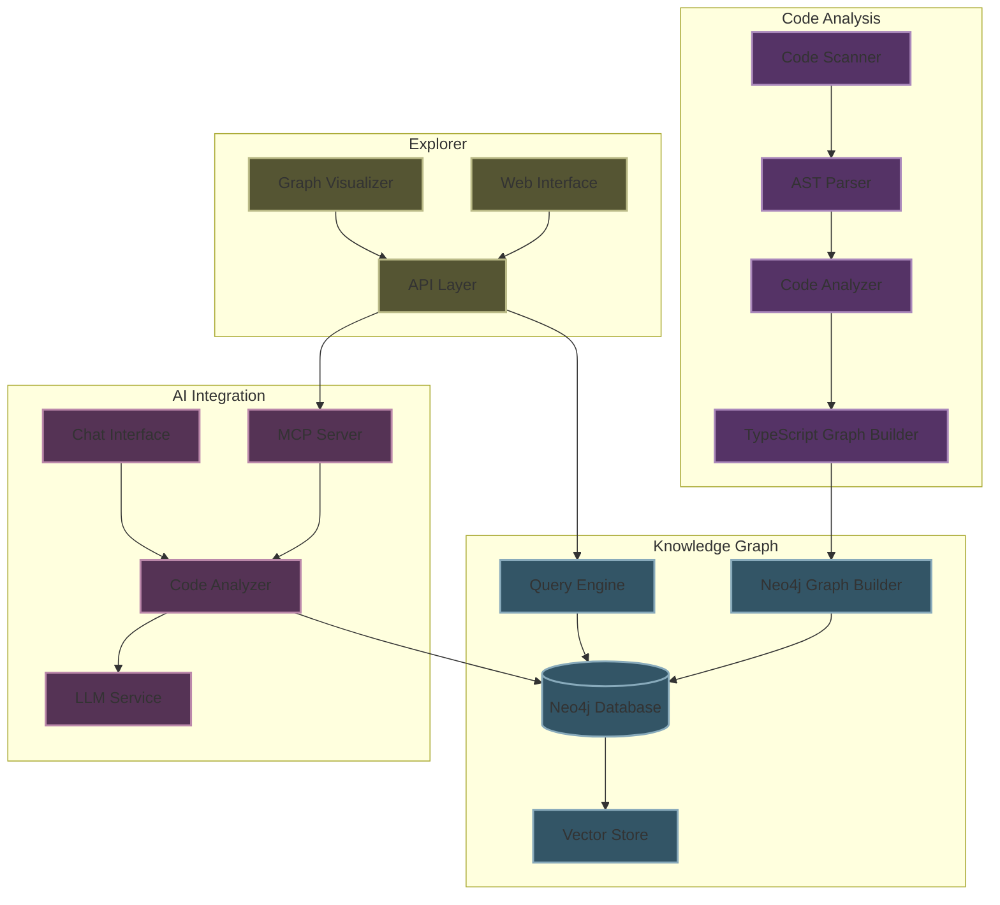

```mermaid
graph TD
    subgraph Code Analysis
        Scanner[Code Scanner]
        Parser[AST Parser]
        Analyzer[Code Analyzer]
        TSBuilder[TypeScript Graph Builder]
    end

    subgraph Knowledge Graph
        Neo4j[(Neo4j Database)]
        GraphBuilder[Neo4j Graph Builder]
        QueryEngine[Query Engine]
        VectorStore[Vector Store]
    end

    subgraph Explorer
        UI[Web Interface]
        APILayer[API Layer]
        Visualizer[Graph Visualizer]
    end

    subgraph AI Integration
        LLMService[LLM Service]
        CodeAnalyzer[Code Analyzer]
        MCPServer[MCP Server]
        ChatServer[Chat Interface]
    end

    Scanner --> Parser
    Parser --> Analyzer
    Analyzer --> TSBuilder
    TSBuilder --> GraphBuilder
    GraphBuilder --> Neo4j
    QueryEngine --> Neo4j

    Neo4j --> VectorStore

    APILayer --> QueryEngine
    UI --> APILayer
    Visualizer --> APILayer

    CodeAnalyzer --> Neo4j
    CodeAnalyzer --> LLMService
    MCPServer --> CodeAnalyzer
    ChatServer --> CodeAnalyzer

    APILayer --> MCPServer

    classDef core fill:#553366,stroke:#aa88bb,stroke-width:2px
    classDef db fill:#335566,stroke:#88aabb,stroke-width:2px
    classDef ui fill:#555533,stroke:#bbbb88,stroke-width:2px
    classDef ai fill:#553355,stroke:#bb88aa,stroke-width:2px

    class Scanner,Parser,Analyzer,TSBuilder core
    class Neo4j,GraphBuilder,QueryEngine,VectorStore db
    class UI,APILayer,Visualizer ui
    class LLMService,CodeAnalyzer,MCPServer,ChatServer ai
```
